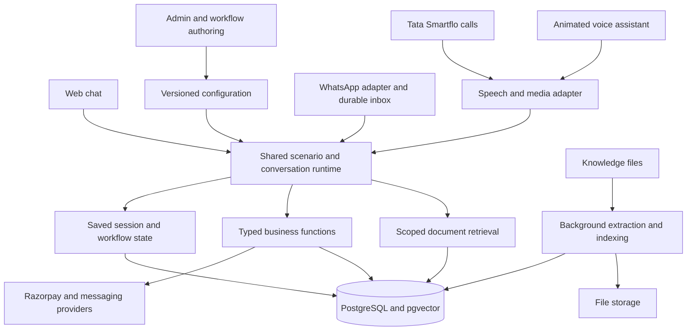

# Earthora AI platform architecture and migration plan — superseded

Superseded on 15 September 2026 by [Earthora AI Platform — Master Plan](<C:/Earthora/Earthora Code/output/earthora-ai-platform-master-plan.md>). This document is retained as planning history, not the execution reference.

Status: proposal for discussion, September 15, 2026. Prepared with Astra architecture and repository assessments. Implementation, migration, provisioning, and service removal follow the planning discussion.

## 1. Decisions and initial scope

Build one application with a shared scenario workflow engine for Chat, browser Voice, WhatsApp, and Tata Smartflo Calls. Workflows govern conversation behavior; the knowledgebase supplies evidence; functions read or change business records; saved session state carries context between turns.

Confirmed by the owner:

- Initial knowledgebase: 50 files. Actual pages, bytes, extracted text, and chunk count will be measured during inventory.
- Initial traffic: 10 simultaneous chats and calls. Planning assumes 10 combined active conversations, including a test with all 10 using voice. A separate stress profile will exercise 10 chats plus 10 calls.
- Branded animated assistant with voice and chat, without a human video avatar in the first release.
- Earthora first, with support for additional businesses in the architecture.
- Move Supabase data and Netlify hosting to Hostinger KVM8 and replace the existing voice and WhatsApp services completely.
- Main administration: Dashboard, Knowledgebase, Workflows, Functions, Channels; Channels contains Chat, Voice, WhatsApp, Calls.

Proposed addresses: `ai.earthorafarms.com` for the assistant platform, `/admin` for administration, `/chat` and `/voice` for public experiences, and `/api`, `/ws`, and `/webhooks` for its interfaces. The storefront keeps `earthorafarms.com` and its existing public routes. These are proposed addresses, not configured DNS.

The referenced voice-settings screenshots were not available in this conversation. Settings below are a proposed functional specification; visual matching can follow when the images are available.

## 2. Physical architecture

Use a modular TypeScript application: one codebase with explicit modules and independently runnable API, media, and background-worker processes. Retain React/Vite/Tailwind familiarity for the web interfaces and Fastify for the backend. Docker Compose is sufficient for the initial deployment.

Initial KVM8 services:

- Reverse proxy: HTTPS, static storefront/admin assets, API routes, streaming connections, and provider webhooks.
- Application API: sessions, roles, administration, scenario runtime, business functions, and storefront endpoints.
- Media process: browser/Smartflo audio connections, interruption handling, provider speech adapters. It shares the same domain code and workflow API.
- Worker: document parsing/indexing, outbound message delivery, invoices, notifications, and scheduled reconciliation.
- PostgreSQL with pgvector: business records, workflow definitions/runs, evidence metadata, embeddings, and durable inbox/outbox jobs.
- Persistent file volume behind a storage interface: source documents, product images, exports, and any enabled recordings. Keep binary files outside normal database rows; support moving the storage interface to an object store later.
- Off-server database/file backups and external uptime monitoring.

For the initial load, use PostgreSQL-backed job claiming and session state. Add a dedicated cache or queue only when measurement or a selected library creates a concrete need. Live audio frames and streamed responses bypass background-job queues. CPU-heavy extraction runs in the worker with resource limits so imports cannot monopolize call processing.

Hostinger currently lists KVM8 with 8 vCPU cores, 32 GB RAM, and 400 GB NVMe storage. Treat it as an initial app/database host; use provider APIs for production language and speech inference until measured evidence supports a different choice. The advertised machine specification does not establish this application's call capacity. [Hostinger specifications](https://www.hostinger.com/in/vps/freepbx-hosting)

A single VPS supports an enterprise-quality application foundation, but it remains one failure domain. Multiple hosts and database failover are a later availability expansion if the business requires service through a complete VPS outage.

## 3. The scenario workflow model

The owner's proposal can scale if each workflow contains executable structure in addition to a prompt. A document tag identifies relevant information; it does not remember which question was answered, enforce an action's prerequisites, or recover an interrupted checkout.

Each workflow version contains:

1. Purpose, entry examples, exclusions, and completion conditions.
2. Facts to collect, including their types, validators, conditional requirements, and source turns.
3. Steps and permitted transitions.
4. Knowledge collections, tags, document overrides, and product filters available to each step.
5. Allowed functions and any conditions required before calling them.
6. Optional internet search settings: allowed domains, purpose, result/latency budget, and citation behavior.
7. Editable instructions for the overall scenario and individual steps.
8. Handling for missing evidence, unavailable tools, corrections, interruptions, and human handoff.
9. Channel overrides for presentation and language.
10. Test conversations and version/publication history.

Start with a small set of step types: ask for missing information, retrieve evidence, apply a condition, call a function, respond, wait for a customer, call a reusable workflow, hand off, and finish. Provide a guided step editor plus a visual flow preview. A free-form automation canvas is not necessary for the first release.

### AI-assisted authoring

The administrator describes a scenario in ordinary language. The authoring assistant proposes steps and asks only questions needed to resolve missing business behavior. It produces the structured workflow and editable prompts together, suggests relevant files/functions, generates example conversations, and highlights missing evidence or ambiguous branches.

The administrator can edit prompts directly, preview conversations, compare versions, and publish a version. Publishing is an application feature; it is separate from the coding agent's execution authorization. Published prompts are used by the runtime. The application enforces transitions, source scope, and function permissions even when a model suggests a different action.

Do the expensive authoring work when the workflow is created or changed. At runtime, assemble a short prompt from the published step, known facts, allowed tools, and retrieved evidence.

### Two essential starter scenarios

| Scenario | Conversation behavior | Information and actions |
| --- | --- | --- |
| Product recommendation | Learn the customer's goal and only the missing preferences required by approved recommendation criteria; compare suitable options and explain the fit. | Approved product facts and recommendation criteria plus live catalogue/stock; offer cart or checkout help after a recommendation. |
| Product information | Resolve the named product and topic; answer directly. Clarify only when the product or question is ambiguous. | Relevant approved ingredients, usage, benefits, or policy evidence; optional cart action when requested. |
| Order support | Resolve the order through the identity requirements defined for that action; retrieve current status. | Order/tracking functions; customer order records stay outside global document retrieval. |
| Policy question | Resolve the policy topic and any material context, such as destination. | Effective approved policy sections, with citations and configured exception handling. |
| Cart and checkout | Reuse known product/quantity/customer details, collect missing fields, show review, and create the payment path at the intended confirmation step. | Live pricing, stock validation, cart/checkout functions, verified payment finalization. |

For example, a customer says: "Recommend a powder within my budget; I don't want tablets." The workflow records the powder preference immediately and asks for the budget only if it is required and still missing. It does not restart with a generic list of intake questions.

During checkout, "How should I store this?" temporarily enters product information. The answer returns to the pending checkout step, retaining the cart and delivery details. "Actually make that two" corrects the explicit pending item instead of starting a fresh conversation.

### Runtime state and reliability

Persist an active workflow/version/step, validated facts, the pending question/action, selected products, cart/checkout references, recent messages and a compact summary, and a bounded stack of suspended workflows. Record the document versions supporting an answer and the function results supporting an action claim.

Normalize and deduplicate incoming events, claim a session with a revision/lease, interpret the turn, run permitted steps, then atomically save the state transition and outbound message. Deliver afterward using an outbox. Track multipart delivery separately and represent uncertain provider acknowledgements explicitly.

Every external mutation has an invocation record and idempotency strategy. Repeating a message or payment webhook must not repeat a cart mutation, sale, or stock deduction. Do not assume an external provider guarantees exactly-once message delivery.

Pin workflow versions for active sessions so publishing a revision does not unexpectedly change a conversation midway. Revoked permissions and withdrawn documents still take effect immediately.

## 4. Knowledgebase settings and retrieval

### Settings hierarchy

| Level | Settings |
| --- | --- |
| Workspace | Default languages, publication roles, model/embedding provider profile, storage/retention, default retrieval profile. |
| Collection | Name, description, product/domain scope, source priority, access scope, default workflow mappings. |
| Document | File/source, title, language, product IDs, tags, workflows, version, draft/published/withdrawn status, effective dates, owner. |
| Processing | Extraction preview, OCR when needed, section/table preservation, duplicate detection, chunking profile, indexing status/retry. |
| Workflow retrieval | Allowed collections/tags/files, conditional product filters, answer evidence requirements, result budget, reranking, web search option. |
| Test view | Query, selected workflow, applied filters, retrieved passages and citations, expected answer, feedback and failures. |

Expose ordinary content settings by default. Keep embedding dimensions, search-index tuning, and chunk/token parameters in advanced profiles with tested defaults.

Ingestion pipeline: upload -> parse/OCR -> preserve sections/tables -> chunk -> assign metadata -> create embeddings/search index -> publish. A failed replacement import leaves the previous published version usable. Track hashes and processing versions so unchanged files are not repeatedly indexed.

Import the existing approved product-knowledge records as structured sources, preserving language, approval status, effective dates, and provenance alongside the new files.

Use many-to-many relationships: one document can serve several workflows without copying its contents or embeddings. Collections are the stable information structure; workflow tags and explicit file overrides select subsets.

Retrieval pipeline:

1. Identify the active scenario and concrete entities, such as a product.
2. Apply business/workspace/access/publication/effective-date filters and the workflow's allowed sources.
3. Combine keyword matching with semantic similarity search.
4. Merge candidates, optionally rerank, and expand necessary parent/neighbor sections.
5. Give the model a small evidence packet with source IDs and version/page/section references.
6. Resolve source conflicts using explicit authority and effective-date rules. Ask a useful clarifying question or explain the knowledge gap when evidence is insufficient.

At 50 files, start with simple measured searches; approximate vector indexes are a growth optimization. When adding approximate indexes, test filtered recall: selective filters can reduce returned matches and may need exact searches, partial indexes, partitioning, or iterative scans. PostgreSQL full-text search and pgvector can be combined for hybrid retrieval. [pgvector documentation](https://github.com/pgvector/pgvector)

English, Hindi, Gujarati, transliterated text, and code switching need separate retrieval tests. Multilingual embeddings help semantic matching, while lexical normalization/dictionaries require deliberate testing; English search defaults should not be assumed to handle every language equally.

Prices, stock, order state, coupons, and payment status come from typed live database functions. They are not answered from an old PDF or a cached paragraph. FAQs remain useful factual examples, while the workflow supplies the conversation structure.

For much larger data, narrow first by collections/entities, then retrieve passages; batch indexing, index sizing, and load tests determine when to move search or ingestion to another machine. Add a dedicated search/vector engine only when measured latency, recall, or isolation needs justify it. Document count alone is not a useful capacity specification.

## 5. Administration and channels

### Dashboard

Show conversations by scenario/channel, completion and abandonment, unnecessary-question rate, first useful response latency, tool failures, missing-knowledge queries, ingestion failures, and provider usage/cost. Include conversation traces: selected workflow/step, source passages, function calls/results, and timings.

Keep Conversations/Inbox and Test Lab accessible from Dashboard. Add a compact global Settings area for team roles, business details, providers, budgets, and backups. These support the requested modules without multiplying the main navigation.

### Functions

Start with code-maintained functions: catalogue search, product lookup, availability, cart operations, price calculation, checkout creation, order status, tracking, invoice delivery, and contact/handoff creation. Existing integration semantics and useful tests can be reused after review.

The UI supports select, enable/disable, edit configuration, test, and delete/archive an entry. Configuration includes description, typed inputs/outputs, parameter bindings/defaults, credentials reference, timeout, retry strategy, and applicable preconditions. Preserve version references for workflows and execution history when an entry is retired. Changing executable business logic remains a code change in this initial static-function model.

The tool runner checks workspace/customer context and the allowed functions for the active step. Document text and internet results are evidence, not a source of additional execution permissions.

### Channel settings

| Channel | Proposed first-release settings |
| --- | --- |
| Chat | Assistant name/branding/avatar, greeting, starter prompts, embedded widget/full page, language, source citations, attachments if enabled, session duration, human handoff. |
| Voice | Voice/provider profile, language detection and override, speech speed/style, pronunciation glossary, turn detection, interruption/barge-in, silence/repeat behavior, captions, animation states, recording/retention if enabled. |
| WhatsApp | Provider/number/account identifiers, credentials, generated callback setup, verification, message templates/languages, allowed media, product cards/buttons, delivery status/retries, session rules, human handoff. |
| Calls | Tata Smartflo credentials and numbers, static/dynamic streaming endpoint, inbound routing, authorized outbound-call function if required, business hours, language/voice profile, transfer destination, call duration/silence handling, call records and diagnostics. |

Shared channel settings: enabled workflows, default/fallback scenario, working hours, response tone/length, operator escalation, session retention, and provider usage caps. Protocol-required WhatsApp template/delivery behavior belongs in the adapter; the configuration UI should make actual provider state inspectable.

Smartflo's official documentation supports static WSS endpoints and dynamic endpoint resolution for bidirectional voice streaming. Verify account capabilities and real media events during integration. [Smartflo streaming setup](https://docs.smartflo.tatatelebusiness.com/docs/copy-of-standard-operating-procedure-sop-for-voice-streaming)

The branded avatar shows idle, listening, processing, speaking, and interrupted/error states from actual session events. Chat transcript, speech controls, and animation share the same session. Verified customer linkage is required before resuming a private order conversation across unrelated channels; matching an arbitrary typed name is insufficient.

## 6. Voice architecture and response speed

Keep speech handling replaceable around the same scenario backend. The first voice technical milestone compares a full-duplex voice interface delegating to our runtime against streamed speech recognition -> workflow -> speech synthesis. Pick the default using Earthora's actual English/Hindi/Gujarati conversations, exact product names/numbers, interruption behavior, latency, and cost.

OpenAI currently documents both full-duplex voice with a separate backend and chained speech pipelines. Client delegation can run our own workflow and context policy. It does not guarantee approval of every spoken word: the spoken-output path, interruption handling, and claims about actions still require evaluation. [Voice architecture options](https://developers.openai.com/api/docs/guides/voice-agents) and [client delegation](https://developers.openai.com/api/docs/guides/live-delegation)

For exact checkout amounts and payment claims, use server-produced verified values and a controlled speech rendering path as needed. An acknowledgement or animation is not evidence that a task completed.

Apply the same evidence requirements to spoken product and health claims. Full-duplex is eligible as the default only after its recorded output passes the grounded-answer, interruption, and action-confirmation release suite. If it fails those criteria, use the controlled streamed speech-recognition/workflow/synthesis pipeline. Backend result validation alone is not validation of the final spoken wording.

Latency design:

- Combine intent and fact extraction where possible; resolve explicit pending answers in code.
- Run independent read lookups in parallel and avoid rerouting obvious continuations.
- Use short per-step context, bounded recent history, and scoped tool definitions.
- Cache static configuration and versioned document evidence; invalidate on publication/withdrawal. Refresh volatile commercial facts at the transaction boundary.
- Stream chat and speech when evidence is ready. Count meaningful answers separately from filler acknowledgements.
- Cancel obsolete generated speech after interruption; preserve any already committed business action and reconcile ambiguous provider outcomes.
- Keep heavy imports and optional internet search off the ordinary fast-response path.

Proposed acceptance budgets, to validate rather than advertise as achieved:

| Metric under the initial load | Initial target |
| --- | --- |
| Chat first useful content, ordinary KB turn | p95 at or below 2 seconds |
| Voice first useful audio after the customer finishes, ordinary KB turn | p95 at or below 3 seconds, including turn detection |
| Retrieval stage | p95 at or below 300 ms on the measured initial corpus |
| External actions and internet search | Separate measured budgets with useful progress; no false success on timeout |

Record p50/p95, model/provider/network latency, language, scenario, and concurrent load. Test ten overlapping active conversations and bursts of simultaneous turns while indexing runs. Measure maximum sustainable load before setting admission limits or promising capacity. Select runtime model profiles by task rather than assuming the planning model must serve every customer turn.

## 7. Enterprise foundation and future businesses

- Server-managed staff sessions and role checks on every administration/API action; retain the guest storefront experience.
- Workspace/business IDs in new platform records, caches, file ownership, retrieval scopes, function bindings, and queues. Use tenant-aware unique constraints and authorization tests before onboarding a second business.
- Assign all migrated products, orders, customers, knowledge, file objects, provider credentials, and function bindings explicitly to Earthora's workspace. Preserve that ownership through API queries and database constraints when later businesses are introduced.
- Versioned workflows, prompt changes, documents, and function configurations with publication history and audit records.
- Durable event intake, session concurrency control, retries, and a failed-job inspection/replay view.
- Transactional commerce writes and an outbox for invoices/notifications.
- Trace IDs from channel intake through retrieval/functions to delivery, with customer-visible action outcomes linked to confirmed records.
- Resource limits for imports, model calls, sessions, and outbound jobs; overload behavior and provider fallback are explicit.
- Off-server backups, a tested restore process, rollout/rollback procedure, and monitored storage/database health.

Initial draft recovery objectives: at most 15 minutes of recoverable data loss and restoration within 4 hours, subject to an actual off-server backup/WAL strategy and timed restore drill. These are proposed operational targets, not properties provided automatically by KVM8.

Future scale-out follows measured pressure: move ingestion first if CPU-bound; move file storage if capacity requires it; add API/media replicas for connection load; separate the database/search workload when needed. Live sockets need connection ownership and graceful draining during deploys even when business state is stored centrally.

## 8. Migration assessment and sequence

Repository observations:

- The current browser uses Supabase directly for catalogue/admin data and mutations across many files. It needs an owned API before Supabase can be removed.
- Storefront authentication is guest-only; admin/developer/KACC use custom password/email OTP flows. Live Supabase Auth records still need inventory.
- Website checkout writes order/items/payments/history separately in `src/hooks/useCheckout.ts`; voice uses a transactional finalizer. Unify these paths in the new server and add failed-event reconciliation.
- Netlify and Supabase both have invoice paths. Consolidate delivery to one recorded job per intended invoice event.
- Removing the WhatsApp worker also affects stock alerts and shipment notifications. Preserve these as notification functions in the replacement.
- Product images and raw uploads require copying actual object bytes, not only database metadata/URLs.
- Old voice payment links and invoice URLs can remain in customer messages; compatibility and outstanding payment handling precede retirement.
- The root Render configuration references a separate Python messaging service whose code is absent here. Its live existence and purpose require inventory.

Primary local evidence: `src/hooks/useCheckout.ts`, `src/contexts/auth-context.tsx`, `src/components/Gate.tsx`, `src/components/KaccGate.tsx`, `supabase/migrations/`, `supabase/functions/`, `netlify/functions/`, `voice-service/src/payments/`, `voice-service/src/routes/payment-webhook.ts`, `whatsapp-chatbot/worker.ts`, and deployment files. Repository state does not establish actual deployed schema or configuration.

Supabase's official restore documentation treats storage objects, functions, SMTP/provider settings, and DNS as separate migration work. Our target is ordinary PostgreSQL with an owned API; restoring a full Supabase deployment is a different option and its commands are not a turnkey native-Postgres migration. [Supabase restore boundaries](https://supabase.com/docs/guides/self-hosting/restore-from-platform)

### Execution phases after the planning decision

| Phase | Deliverable and exit condition |
| --- | --- |
| 1. Inventory and baseline | Actual schema/roles/extensions/functions/triggers/sequences; all buckets/files; service/callback/DNS inventory; pending orders/payments/jobs; backup restored to an isolated target; the 50 KB files measured. |
| 2. Host and owned data/API foundation | KVM deployment configuration; PostgreSQL/storage; staff sessions/roles; server commerce functions; restored data copy; storefront/admin adaptation; replacement scheduled/notification work. |
| 3. Vertical slice | New KB ingestion/retrieval plus recommendation and product-detail workflows work in Chat through cart/review; corrections, missing evidence, and interruptions pass. |
| 4. Workflow product | AI authoring, step/prompt editor, source/function selection, simulation, version publishing, traces, static function administration. |
| 5. Voice and channels | Branded voice assistant, measured speech choice, native WhatsApp settings/adapter, Smartflo Calls, notification continuity, and channel-specific test coverage. |
| 6. Acceptance preparation | Corpus/conversation evaluation, concurrency and recovery tests, integration rehearsal, and verification of the provider configuration and callback paths needed for the live trial. |
| 7. Controlled cutover and live trial | Quiesce old writers, durably capture in-flight events, final data/object sync and reconciliation, and switch storefront/API/DNS/provider routing with one authoritative writer. Run the owner's specified limited live purchase and reconcile payment/order/stock/invoice before broadening traffic. |
| 8. Retirement | Drain/reconcile old obligations, preserve necessary links or wait for expiry, verify new paths, remove old voice/WhatsApp deployments/code/config and obsolete Supabase/Netlify/Render dependencies, retain business history and recoverable backups. |

Restore preserves IDs, timestamps, foreign keys, balances, and sequences. Avoid executing stock deduction or notification triggers against imported historical rows. Replace Supabase-specific roles/auth functions with the owned authorization model instead of copying public write access blindly.

Cutover must account for current commerce writes and webhook events, not only DNS. After new transactions reach PostgreSQL, rollback includes reconciling those writes; changing DNS back alone is insufficient. Keep staff access, invoices, coupon/stock behavior, image URLs, tracking, storefront redirects, and public SEO routes in the acceptance checklist.

The live purchase writes to the authoritative database during controlled cutover, not to a disposable migration copy. Route callbacks for existing and new payment links through the same reconciled ledger so subsequent synchronization cannot overwrite a live trial or create a duplicate sale.

Migration success means row counts and business aggregates reconcile, file counts/checksums match, payment records agree with provider records, and the new browser/runtime no longer depends on old hosting endpoints. Old chat/call runtimes can be removed completely while historical sales and messages are retained according to the chosen retention rules.

## 9. Verification criteria

Create an initial reviewed set of about 100 multi-turn cases covering the actual files and scenarios, with held-out paraphrases and language variants. This is a proposed starting test set, not a statistically sufficient proof of universal accuracy.

Required behavior:

- Recommendation and product-information requests take the intended distinct paths.
- The assistant uses facts already supplied, asks only material missing questions, and resumes correctly after interruptions.
- Answers cite effective approved source passages; withdrawn/contradictory documents are handled explicitly.
- Product names, quantities, phone numbers, and addresses survive English/Hindi/Gujarati speech and corrections.
- A workflow cannot read another business's/customer's records or call an unlisted function.
- A timeout cannot be presented as a successful action; delayed results are reconciled.
- Duplicate messages, restarts, and repeated payment callbacks do not duplicate business effects.
- Price/stock changes between discussion and checkout are recalculated by the server.
- The limited live trial checks the actual channel, provider, database, stock, invoice, and customer-visible result. Rehearsal is preparation for this acceptance step.
- Ten simultaneous sessions meet the measured latency target during normal operation and document ingestion; overload and recovery remain understandable.
- A backup restores successfully onto a fresh target and the result passes a commerce smoke test.

Proposed initial quality thresholds: at least 95% correct scenario routing and task completion on the reviewed applicable cases; no unsupported price/payment/action-success claims or unauthorized tool execution in the release suite. Report both numerator/denominator and failure categories; do not turn a test pass rate into a general accuracy guarantee.

## 10. Decisions reserved for execution inventory or product discussion

The architecture can proceed with the confirmed requirements. Final file sizes/formats, actual KVM region/resources and existing workloads, deployed database/storage size, provider account features/quotas, and pending payments are measured facts to obtain during execution inventory.

Select the final subdomain label and voice provider/model profiles during setup and the first measured voice milestone. The first release assumes native configurable WhatsApp through the provider selected for the business, preserving the currently required Tata integrations where applicable. Required medical/product eligibility criteria must come from approved business knowledge, not invented by the workflow authoring assistant.

Primary recommendation: make the workflow authoring experience, saved conversation state, scoped evidence, and live business functions the core product. They address the owner's FAQ-only failure mode while keeping the first deployment practical for 50 files and 10 concurrent conversations.
